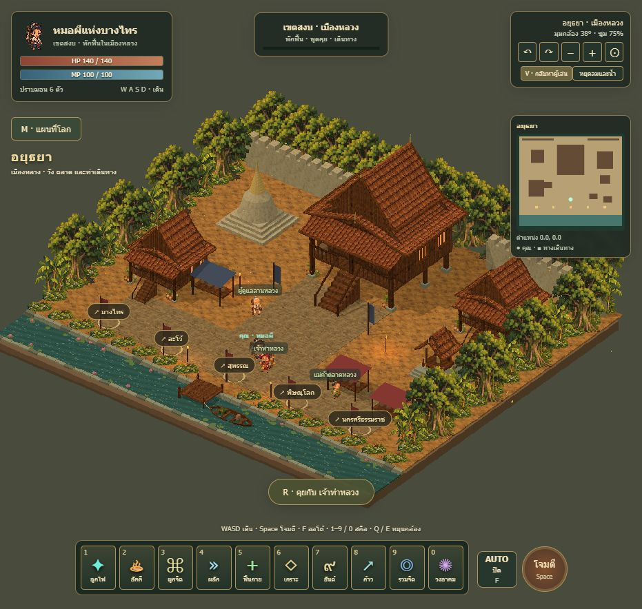

# Ayothaya Folk Mystic

เกมแฟนตาซีไทยแบบ Chibi Pixel 2.5D หมุนกล้องได้ เดินทางระหว่าง 6 เมือง โดยมี **อยุธยาเป็นเมืองหลวง**

**[เปิดเล่นออนไลน์](https://thanatzhu.github.io/ayothaya-folk-mystic/)** · **[ภาพทั้ง 6 เมือง](https://thanatzhu.github.io/ayothaya-folk-mystic/world-gallery.html)**

## เมือง

อยุธยา · บางไทร · ละโว้ · สุพรรณ · พิษณุโลก · นครศรีธรรมราช

แต่ละเมืองมีผังอาคาร จุดเกิด NPC และเส้นทางเดินทางของตัวเอง พร้อมน้ำไหล เรือโยก ลม ใบไม้ร่วง และพืชประจำภูมิภาค ผังเมืองเป็นแฟนตาซี ไม่ใช่การจำลองแผนที่ประวัติศาสตร์

## ควบคุม

- คอม: WASD เดิน, Space โจมตี, F ออโต้, 1–9 และ 0 สกิล, Q/E หมุนกล้อง
- M แผนที่โลก, R คุย/เดินทางเมื่ออยู่ใกล้, V ดูทั้งเมือง
- มือถือ: **เล่นแนวนอนเท่านั้น** จอยซ้ายเดิน ปุ่มขวาโจมตี/สกิล ลากฉากฝั่งขวาหมุนกล้องและสองนิ้วซูม
- แนวตั้งแสดงหน้าขอให้หมุนเครื่องและพักเกม ปุ่มเต็มจอพยายามล็อกแนวนอนเมื่อเบราว์เซอร์รองรับ เบราว์เซอร์ที่ไม่รองรับต้องหมุนเครื่องเอง

เว็บเปิดเล่นได้ผ่านอินเทอร์เน็ต แต่เกมรุ่นนี้ยังเป็น **single-player prototype** ไม่มีเซิร์ฟเวอร์ผู้เล่นร่วมโลกเดียวกัน ข้อมูลระหว่างเมืองเก็บใน sessionStorage ของแท็บ ไม่ใช่เซฟบัญชีผู้เล่นถาวร

## รันในเครื่อง

ใช้ Python 3: `python -m http.server 8767` แล้วเปิด `http://localhost:8767/`

ทดสอบด้วย Node.js: `npm test` (ไม่ต้องติดตั้งแพ็กเกจ)

ไลบรารี Three.js อยู่ใน `vendor/` พร้อมไฟล์ลิขสิทธิ์ ไม่มี CDN หรือ API key ฝั่งหน้าเว็บ

## แก้แมพและภาพ

`maps/world.json` คือข้อมูลฉากและเส้นทาง `maps/*.blend` และ `maps/*.glb` คือโครงสร้างฉากทั้ง 6 เมือง สร้างใหม่ด้วย Blender: `blender --background --python build_world05.py`

Blender เก็บ geometry/UV; ตัวละคร พืช พื้นผิว แสง และโมชั่นประกอบใน `viewer-world.js` กับ `ambient-motion.js` ภาพ PNG และพรอมป์จาก built-in ImageGen อยู่ใน `assets/`

ส่วนเกม: `combat-core.js`, `game-controls.js`; การเดินทาง: `world-ui.js`, `world-state.js`; แนวนอนมือถือ: `mobile-layout.js`, `mobile-layout.css`

## ตรวจสอบ

28 automated tests ครอบคลุมการเดิน การชน ทางอ้อม ต่อสู้ จุดเกิดทุกเมือง ข้ามเมือง และกฎแนวนอน ทดสอบ UI ด้วย viewport 390×844 และ 844×390; ยังไม่ได้ยืนยัน hardware orientation lock หรือ multitouch ด้วยมือถือจริง

## เผยแพร่

GitHub Pages ใช้ branch `main` ที่ root โฟลเดอร์นี้มี `.nojekyll` และใช้เส้นทาง relative เพื่อรองรับชื่อ repository ใน URL ผลัก commit ใหม่เพื่ออัปเดตเว็บ
